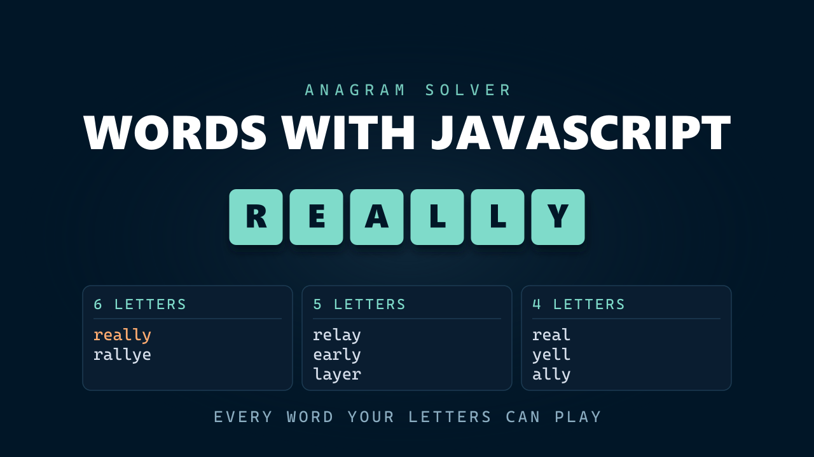

<p align="center">
  
</p>

<h1 align="center">Words With JavaScript</h1>

<p align="center">
  <strong>Type your letters and get back every word you can play, grouped by length.</strong>
</p>

<p align="center">
  <a href="https://dangervalentine.github.io/javascript-words-with-javascript/">Live Demo</a>
</p>

<p align="center">
  <a href="https://dangervalentine.github.io/javascript-words-with-javascript/">
    
  </a>
</p>

<p align="center">
  
  
  
  
  
  
</p>

---

A helper for Words With Friends, Scrabble and WordScapes. Give it up to eleven letters and it scans **172,724 English words** for every one you could build from them, grouped longest-first so the word actually worth playing is the first thing you see.

It was built for my dad, who plays these games for hours and phones the family when one last word eludes him. Solving it once seemed easier than being on call.

## Features

**Longest-first results** &mdash; Words are grouped by length with the longest group at the top, because a nine-letter word is the reason you came.

**Letter rack** &mdash; What you type is mirrored as physical tiles below the field, so the letters you hold stay visible while you read down the results.

**Instant search** &mdash; The scan runs in single-digit milliseconds against the full dictionary. Input is debounced, so typing quickly costs one search rather than one per keystroke.

**Micro-interactions** &mdash; Tiles land with a spring and re-flow when you delete from the middle, result groups stagger in longest-first, and a clear button fades in once there is something to clear.

**Accessibility** &mdash; The result summary is an `aria-live` region, so screen readers hear the count change; `prefers-reduced-motion` is honoured globally through a single `MotionConfig`.

## How It Works

A word is playable when it needs **no more of any letter than you are holding**. That is the whole algorithm — the work is in making it fast enough to feel instant.

Each word becomes a count of its letters. The letters `r`, `e`, `a`, `l`, `l`, `y` look like this:


The word `real` looks like this:


Every bar in the second image fits under the matching bar in the first, so `real` is a match. The word `table` looks like this:


`t` and `b` are not in your rack at all, so `table` is discarded. Run that comparison across the dictionary and the matches are your answer.

```
"really" ──► held[26] — one count per letter
                  │
                  ▼
         For each dictionary word (pre-filtered to ≤ 11 letters):
         ├── skip it if it is longer than what you hold
         ├── compare its 26 counts against yours
         └── keep it only if every count fits
                  │
                  ▼
         Bucket the matches by length, sort longest-first
```

**The index is built once.** The original recomputed a 26-key object for all ~170,000 words *on every keystroke* — roughly 4.4 million property writes per letter typed. Now the per-word counts are computed once, on load, into a single flat `Uint8Array` of 26 slots per word: one allocation instead of ~170,000, and the comparison walks contiguous memory. A search over the full dictionary lands in low single-digit milliseconds.

**The dictionary is fetched, not bundled.** At 2.4MB it was being inlined into the JavaScript, which meant nothing rendered until all of it had parsed. As a static asset the shell paints immediately, the browser caches the dictionary separately, and the bundle dropped from 2,448KB to 360KB.

## Theming

Every colour resolves through [`src/theme.css`](./src/theme.css), which holds the **Night Owl** dark palette as `--nowl-*` custom properties.

Colours live in CSS and nowhere else. `motion` only ever animates `transform` and `opacity` — never colour — so there is no second copy of the palette in JavaScript that can drift out of sync with the stylesheet. To retheme, change the tokens; nothing else hardcodes a colour.

Timing is centralised the same way, in [`src/motion.js`](./src/motion.js) — every spring, stagger and the search debounce. One edit retunes the whole feel.

The icons and the title art are generated from that palette and need regenerating when it moves: `public/favicon.svg`, `public/favicon.ico`, the two PNG app icons, and `public/words-with-javascript.png`.

## Quick Start

```bash
npm install
npm run dev        # dev server at http://localhost:5173/javascript-words-with-javascript/
npm run build      # production bundle in ./dist
npm run preview    # serve the production bundle locally
```

Vite's `base` is set to `/javascript-words-with-javascript/` in [`vite.config.js`](./vite.config.js) so assets resolve correctly on GitHub Pages. The same base path applies to the dev server URL &mdash; use `/javascript-words-with-javascript/`, not `/`.

## Tech Stack

- **React 19** &mdash; function components and hooks; the class component is gone
- **Vite 6** &mdash; dev server, build, GitHub Pages base path
- **Motion 12** &mdash; springs, `AnimatePresence`, and `layout` for the letter rack
- **Typed arrays** &mdash; a flat `Uint8Array` letter index over the whole dictionary
- **Night Owl** &mdash; one token file drives every colour in the app

## Project Structure

```
src/
├── App.jsx                 Input state, debounced search, result layout
├── index.jsx               React 19 createRoot + MotionConfig entry
├── helper.js               Dictionary index + the frequency-subset search
├── motion.js               Every spring, stagger and the search debounce
│
├── theme.css               Night Owl tokens as --nowl-* properties
├── index.css               Reset + font stack
├── App.css                 Component styles, all reading the tokens
│
├── Header.jsx              Tile mark, wordmark, credit
├── LetterInput.jsx         Letter field, clear button, tile rack
├── ResultGroup.jsx         One length group of matching words
└── logo.svg                The tile mark, shared with the favicon

public/
└── dictionary.json         172,724 words, fetched at runtime
```

## Deployment

[`.github/workflows/deploy.yml`](./.github/workflows/deploy.yml) builds and publishes to GitHub Pages on every push to `master`, using the modern `actions/deploy-pages` flow (no `gh-pages` branch).

One-time setup on the repo:

1. **Settings → Pages → Build and deployment → Source:** select **GitHub Actions**.
2. Push to `master` (or run the workflow manually from the Actions tab).

If you fork the repo, also update the `base` value in `vite.config.js` to match your repo name.

## License

[MIT](https://choosealicense.com/licenses/mit/)
